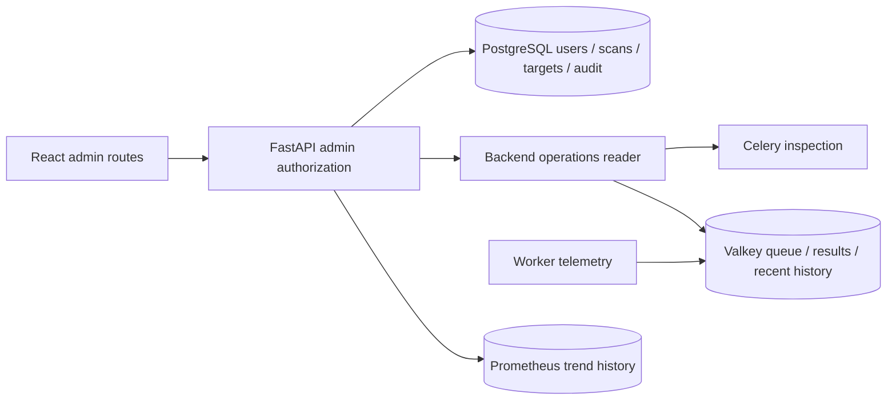

# Implementation Plan: Admin UI

**Date**: 2026-10-08 | **Status**: Planned | **Specification**: [spec.md](spec.md) | **Tasks**: [tasks.md](tasks.md)

## Architecture

Reuse React, Shadcn/UI, TanStack Query, FastAPI, SQLAlchemy/Alembic, and the existing Celery/Valkey deployment.

Celery access is read-only from the admin feature. Workers write telemetry as part of normal execution. The backend creates a narrowly configured Celery client; it must not import `worker.celery_app`, which registers signals and initializes worker instrumentation. Add required dependencies with `uv add` in the backend package and update the lockfile. Broker credentials remain server-side.

Wire `CAMPLY_VALKEY_URL` and `CAMPLY_PROMETHEUS_URL` into the backend Compose service (internal defaults `redis://valkey:6379/0` and `http://prometheus:9090`; host development uses localhost). Backend timing settings use the same `CAMPLY_HEARTBEAT_INTERVAL` and `CAMPLY_TARGET_COOLDOWN` values as the worker, without importing worker application initialization. Mirror settings in backend/worker configuration and document one deployment source of truth. Monitoring dependencies do not gate backend startup or database administration. Backend retains its own Celery client and broker connection; no browser infrastructure credentials.

## Existing implementation findings

- `db/models/users.py` has early-access status but no admin role or scan-suspension flag.
- `user_scans.py` already has `is_active`; targets are shared through `target_id`.
- `auth.py` supports basic, legacy local, and Auth0 modes. API documentation does not fully reflect the current basic mode.
- `routers/scans.py` currently gates ownership through authentication but does not apply `require_early_access`. Preserve existing early-access behavior in this feature; do not silently expand its enforcement.
- Discovery and notification fan-out select active scans without a user-level suspension check.
- Queued scanner tasks do not check whether any eligible subscribers remain before calling providers.
- Notification tasks receive a user ID but no originating scan ID.
- Celery results expire after one hour. Some task errors are returned as dictionaries; Celery state alone is insufficient to identify application failure.
- Prometheus is already deployed with persistent storage and 30-day retention. Backend metrics include users, scans, targets, and campground lookup requests; worker metrics include task counts/durations, provider errors, and successful notifications. The existing `ACTIVE_USERS` gauge counts all users, and `ACTIVE_SCANS` counts saved active flags without user eligibility; these definitions need explicit treatment in admin graphs.

## 1. Data and administrator authorization

Add `User.is_admin` (default false) and `User.scanning_enabled` (default true), including server defaults and a migration that preserves existing user behavior. Do not rewrite `UserScan.is_active` when suspending a user.

Extend `CurrentUser` and `/api/me` with both flags. Normal profile updates must not accept either flag. Add a `require_admin` dependency to every `/api/admin` endpoint. UI route guards are presentation only; API authorization is authoritative.

Basic/local owner resolution bootstraps admin access for the configured owner, including an existing owner row; Auth0 signup never automatically grants admin access. Add a task-wrapped provisioning command accepting a database user UUID for initial Auth0 administrator setup. No browser role-management endpoint.

Add `AdminAuditEvent`: ID, actor user ID, action, subject type/ID, previous/new allowlisted boolean values, and timestamp. Commit it atomically with changes; no token values or arbitrary request bodies. Provide a paginated read endpoint.

**Verify:** migration against existing users; admin authorization across all auth modes; self-service privilege escalation rejected; change/audit atomicity and idempotent writes.

## 2. Enforce scanning suspension end to end

Effective scanning eligibility is `User.scanning_enabled AND UserScan.is_active`. Keep this predicate in a small shared helper in the DB package, used by API/worker code where applicable.

- Creation/resumption reads current database eligibility and returns `403` with `ERR_SCANNING_DISABLED` for disabled users, including admin attempts to resume their scans.
- Serialize creation/resumption against suspension using the same user-row lock, so a concurrent request cannot create/resume a scan after suspension has committed.
- Reads, profile updates, filter edits, pauses, and deletions remain available under existing ownership rules.
- Discovery selects only targets with eligible subscribers.
- Scanner tasks re-check eligibility after acquiring the target lock and before provider work. If no eligible subscribers remain, return a skipped outcome.
- Fan-out selects only eligible subscribers and passes `scan_id` as notification task context.
- Delivery reloads user and scan eligibility immediately before the outbound send. Old queued messages lacking `scan_id` still enforce user suspension; scan-specific eligibility is unavailable for those messages and documented as a rollout limitation.

Make notification `scan_id` an optional additive task argument. Validate its owner matches `user_id` and skip deleted or paused scans. Deploy the backward-compatible delivery consumer before scanners start sending this argument, or restart all worker services together after the migration. Avoid mixed old/new worker pools accepting unsupported task arguments.

Suspension takes effect at the next eligibility check. Provider requests or notification sends already in flight cannot be recalled; do not terminate Celery tasks. Re-enabling may make preserved active scans due on the next normal discovery cycle.

**Verify:** disabled user remains authenticated; all mutation paths respect suspension; pre-queued checks/notifications skip; shared targets continue; pause settings survive re-enable; concurrent mutation behavior.

## 3. Admin API for users, scans, and targets

Use typed Pydantic responses and existing offset/limit conventions, capped at 200. Use deterministic ordering with ID tie-breakers. Counts must use the same filters as list queries. Batch related metadata and compute aggregates without loading every scan/result.

| Endpoint                      | Purpose                                            |
| ----------------------------- | -------------------------------------------------- |
| `GET /api/admin/overview`     | User/scan/target counts and overdue target summary |
| `GET /api/admin/users`        | Search email/ID; filter scanning/access status     |
| `GET /api/admin/users/{id}`   | User detail and scan counts                        |
| `PATCH /api/admin/users/{id}` | Change `scanning_enabled` only                     |
| `GET /api/admin/scans`        | Cross-user scan list and filters                   |
| `GET /api/admin/scans/{id}`   | Scan, owner, cached results, and target            |
| `PATCH /api/admin/scans/{id}` | Change saved `is_active` only                      |
| `GET /api/admin/targets/{id}` | Shared target detail and paginated subscribers     |
| `GET /api/admin/audit`        | Paginated administration history                   |

Admin user DTOs expose notification configuration presence, never notification tokens. Distinguish saved state, suspension reason, eligible subscriber count, and last successful target check. Never interpret cached availability as proof of notification delivery.

Define target staleness using the configured cooldown plus two discovery intervals. Never-checked eligible targets become overdue after the same grace period from creation; targets without eligible subscribers are dormant, not overdue. Read the actual worker timing configuration on the backend rather than hardcoding separate defaults.

**Verify:** permission boundaries, filtering/pagination totals, shared-target links, redaction, accurate aggregate queries, stale/dormant classification.

## 4. Backend read-only operations service

Add backend operations reader and three admin GET endpoints:

- `/api/admin/operations`: worker responses, active/reserved/scheduled counts, ready queue depth, discovery freshness, and source availability.
- `/api/admin/operations/tasks`: bounded, paginated recent execution history with task-type/outcome filters.
- `/api/admin/operations/tasks/{task_id}`: available attempt history, live status, result, and related entity IDs.

Offload blocking Celery/Redis calls from async request handlers. Proposed initial limits: two-second inspection timeout, bounded broker socket timeouts, five-second total operations budget, ten-second snapshot cache. Frontend refreshes visible operations views every 15 seconds and pauses background polling. Return snapshot timestamp and source-specific errors; database admin pages work when operations services are unavailable.

Inspect worker stats, active, reserved, and scheduled tasks. Read queue depth without consuming messages, accounting for configured queue/priorities. Ready messages, worker reservations, active tasks, and scheduled retries are different measures; do not present their sum as an exact global backlog. No workers responding means unknown/unreachable, not proof that none exist.

Apply one overall deadline across inspection calls rather than a fresh timeout for every call; cap concurrent collection and share in-flight snapshot requests so multiple admins do not multiply broker load. Project all live inspection responses and task results through allowlisted DTOs, just like stored telemetry. Never return raw `args`, `kwargs`, result dictionaries, exception strings, or tracebacks. Unknown task types expose only safe lifecycle metadata. Cap live task lists and disclose truncation.

Worker instrumentation records allowlisted task lifecycle metadata and normalized application outcomes in a bounded Valkey stream (24-hour age trimming and 1,000-record cap), with task-ID lookup indexes sharing the retention bounds. Store task/attempt IDs, task name, worker, timestamps, duration, related entity IDs, outcome, and safe reason codes. Exclude task payloads, credentials, raw exceptions, and tracebacks. Telemetry writes must not fail business tasks.

The capacity cap may shorten actual history to much less than 24 hours at high volume. Return the oldest available record, retention limits, and truncation metadata; do not promise a full day's task history. Maintain last-discovery metadata in a separate bounded/expiring key so high task volume cannot evict the only scheduler-progress signal. Task lookup indexes must be cleaned with stream eviction, not grow independently. Broker operations remain inspection-only; telemetry maintenance is performed by workers.

Keep Celery execution state separate from application outcome (`success`, `error`, `skipped`, `retrying`, `unknown`). Ensure Celery retry exceptions propagate rather than being converted into error results by broad exception handlers; test exhaustion separately. Record returned error outcomes accurately without redesigning unrelated task behavior.

Track the last completed discovery execution and its counts/outcome. This indicates scheduler-to-worker progress, not direct proof that the Beat process is alive. Display that distinction. Persist recent history across API restarts but explicitly expose the configured retention window and gaps after Valkey loss. Longer durable history is deferred.

**Verify:** actual broker read-only behavior, worker timeout/partial responses, priority queue counts, result expiry, stream/index trimming, error-result normalization, real retry lifecycle, telemetry failure isolation, no operational mutation routes.

## 5. Frontend integration

Add `/admin`, `/admin/users`, `/admin/users/:id`, `/admin/scans`, `/admin/scans/:id`, `/admin/targets/:id`, `/admin/operations`, and `/admin/audit` within the existing layout. Show admin navigation only for administrators and guard every route. Reuse existing API/client conventions and generate OpenAPI types through `task frontend:codegen`.

Use paginated tables, URL-backed filters, and detail views. User suspension controls explain that login remains available and saved scans are preserved. Scan cards show suspended state separately from paused state. Update the regular dashboard and scan form to reflect scanning suspension, while handling backend `403` responses if cached profile flags are stale.

Operations views contain inspection and navigation only. Show last refresh, partial data, unknown status, and recent-history retention clearly. Link tasks to relevant target/user/scan pages when context is available. Invalidate affected admin queries and `/me` after changes; refresh profile eligibility on focus so other sessions converge.

**Verify:** route protection, user and scan actions, shared-target navigation, suspended regular dashboard, mutation errors, dependency outages, visible-view polling, and responsive layout.

## 6. Trend graphs and historical aggregates

Add graphs to the admin overview, with operational trends also visible on `/admin/operations`. Keep all history access behind a typed, admin-authorized `GET /api/admin/trends?range=24h|7d|30d` endpoint. The backend uses a configured internal Prometheus URL and fixed allowlisted queries; do not accept arbitrary PromQL or destination URLs. Reuse bounded HTTP timeouts and caching. A Prometheus outage affects graphs only.

| Graph                      | Definition and source                                                                                                     |
| -------------------------- | ------------------------------------------------------------------------------------------------------------------------- |
| User growth                | Sampled total registered users and newly registered user counter                                                          |
| Scan creation              | Successfully committed new `UserScan` records per bucket, including scans subsequently deleted                            |
| Scan activity              | Sampled saved-active scan count and effective eligible scan count as separate series                                      |
| Polling demand             | Sampled distinct targets with at least one eligible subscriber; compare with eligible scans to show sharing               |
| Campground lookup volume   | Existing search endpoint request counter; label as requests, including autocomplete/repeated calls                        |
| Polling outcomes           | Actual provider checks and normalized application success/error/skip/retry counts; no inference from Celery success alone |
| Worker duration and alerts | Task duration derived from histograms and successful notification delivery counter                                        |

Add committed user/scan creation counters in the backend and gauges with explicit names for total users, eligible scans, and eligible targets. Preserve existing metric meanings for existing consumers; graph total users as registered users, never logged-in users. Add outcome counters and provider-check instrumentation in the worker. Update metrics export and multiprocess aggregation as needed so the new series are actually scraped and correct across API/worker processes. Count success only after the relevant operation succeeds. Business operations must remain successful if metrics collection fails.

Use Prometheus range queries for gauges and reset-aware bucket increases for counters. Apply `rate`/`increase` to each counter series before summing across scrape targets, so resets are handled independently. Treat counter-based creation rates as sampled operational measurements, not an exact audit ledger. Test counter resets and first-sample limitations. Suggested buckets: 15 minutes for 24 hours, one hour for 7 days, and one day for 30 days; return at most 200 points per series. Use UTC bucket boundaries and display the timezone explicitly.

Database totals are global snapshots: use a single-snapshot or most-recent aggregation strategy, not a sum of per-process copies of the same total. Execution counters/histograms aggregate actual per-process work. Verify both multiprocess and single-process metric export; the current backend's fresh registry has no collectors in single-process mode. Multiprocess metric-directory cleanup happens once at service startup, never on backend inspection imports or child task execution. These corrections are required for reliable admin graphs, not optional monitoring cleanup.

Responses include metric name, unit, points, bucket size, queried time bounds, and available coverage. No samples before instrumentation or during collection gaps are fabricated. Do not derive historical active counts from current rows or backfill deleted scan creation from the surviving table. The 24-hour/1,000-record task stream remains for inspection; trend graphs use Prometheus aggregates independently of its trimming. Retain existing 30-day Prometheus storage policy and document the dependence on monitoring being enabled.

Use line graphs for sampled counts and bucketed bars for creation/request volumes. Provide legends, tooltips, range selection, loading/unavailable states, and a tabular alternative. Evaluate a maintained React chart library during implementation rather than building a custom plotting system; install through the frontend package manager and commit its lockfile. The frontend receives display-ready series through TanStack Query and performs no infrastructure queries.

**Verify:** new metrics are exported/scraped; multi-process totals are correct; suspension changes eligibility graphs; deletion preserves prior samples; range/bucket bounds, resets, initial history, missing samples, dependency outages, chart labels/accessibility, and endpoint authorization.

## 7. Replace Grafana with native admin monitoring

The Admin UI is the application's administration and monitoring interface. Retain Prometheus as an internal time-series service, queried exclusively by FastAPI. Do not embed Grafana, link administrators to it, or require a second monitoring login. Complete this dashboard inventory before removing Grafana at the end of implementation:

| Existing Grafana panels                                                 | Admin destination and behavior                                                                                |
| ----------------------------------------------------------------------- | ------------------------------------------------------------------------------------------------------------- |
| Backend Status; Worker Status; Workers Available                        | Operations health cards: scrape health/freshness separately from actual Celery inspection responses           |
| Active Users; Active Scans; Unique Targets                              | Overview counts and trends, using registered users, saved-active/eligible scans, total/eligible targets       |
| API Requests / sec by Endpoint                                          | Operations API traffic graph by normalized endpoint                                                           |
| HTTP 2xx Success Rate; HTTP 5xx Error Rate; HTTP Error Rate by Endpoint | API status breakdown, global 2xx/5xx percentages, and endpoint 4xx/5xx rates                                  |
| Request Latency (p50 / p95 / p99)                                       | API latency graph with endpoint selector and histogram-derived quantiles                                      |
| Tasks Executed / min; Task Throughput (/sec)                            | Task throughput graph with selectable task type and explicit units; consolidate duplicate views               |
| Task Success Rate; Task Failure Rate                                    | Celery execution-state breakdown plus distinct normalized application outcomes; retries/skips remain explicit |
| Task Duration (p50 / p95 / p99)                                         | Worker duration graph with task-type selector                                                                 |
| Targets Discovered vs Enqueued / min                                    | Discovery/enqueue rate graph alongside last discovery completion                                              |
| Scan Results Stored & Notifications Sent / min; Notifications / hour    | Results and delivered-notification volume graphs; consolidate duplicate notification panels                   |
| Lock Contention Rate                                                    | Acquired/skipped lock attempt counts and proportions                                                          |
| Campground API Errors by Provider; Provider Error Rate                  | Provider error counts and error percentage using actual provider-call attempts as denominator                 |
| Search Throughput                                                       | Campground lookup request volume/rate, labeled separately from saved scans                                    |
| Targets Checked (Total)                                                 | Actual check execution counter/volume; label as executions, not distinct targets                              |

Inventory source: `backend/monitoring/grafana/dashboards/camply-dashboard.json` (24 non-row panels). Keep this mapping in the feature plan after deleting provisioning so parity remains reviewable. No custom Grafana alert rules or external notification integrations were found in repository provisioning; built-in annotation metadata is not an alerting workflow to reproduce.

Correct metric/query problems during migration: scrape `up` is not a count of available Celery workers; the current checked-target gauge is an execution count, not a distinct target total; provider error rate must not use the current nonmatching task-name regex or all task executions as its denominator. Failed requests/tasks use sensible error styling instead of copied inverted thresholds. Distinguish 4xx client responses from 5xx server failures. Aggregate histogram buckets across workers before calculating quantiles, and return unknown for zero denominators or insufficient samples.

Extend the trends endpoint with fixed `group=usage|api|worker|provider` selections and allowlisted endpoint/task/provider filters. Bound returned series (at most 20 per request, with a documented top-volume selection when more exist) as well as points and query duration. Show safe in-app health notices for scrape failures, stale discovery, overdue eligible targets, and recent application failures. Do not invent traffic/latency alarm thresholds without a defined service objective.

Once parity is verified, remove the `grafana` service, port 3000 exposure, `grafana_data` declaration, Grafana-specific environment references, and `backend/monitoring/grafana/` provisioning files. Keep the Prometheus service, scrape configuration, persistent data volume, and 30-day retention. Update roadmap, checklist, and setup documentation to describe Admin UI monitoring. Removing a Compose declaration does not delete existing persisted volumes; do not run volume deletion or a destructive Compose teardown as part of this change.

**Verify:** each inventory row maps to tested UI/API output; all 24 old panels are accounted for; errors/zero traffic/missing history render accurately; Compose validates and starts without Grafana; monitoring works through authenticated admin routes with Prometheus available and degrades clearly without it. Grafana references remaining in feature history must not imply a runtime dependency.

## Rollout and recovery

Apply the additive migration before deploying code that selects the new user columns. Deploy compatible notification consumers before new producers, then deploy backend/frontend, verify admin provisioning and monitoring, and remove Grafana after parity checks. Existing user scanning behavior defaults to enabled; basic/local ownership retains admin access and Auth0 admin assignment is explicit. Do not downgrade columns while deployed services still depend on them. Keep Prometheus data intact throughout rollout and recovery.

If the API itself is unreachable, the Admin UI cannot diagnose through that API; show a clear connection failure. Deployment/service logs remain an out-of-band recovery tool, rather than introducing another monitoring UI. This limitation does not change normal admin monitoring scope.

## Delivery order and checks

1. Data/auth/suspension → verify migration and eligibility regression tests.
2. User/scan APIs and UI → verify complete administration journeys and audit records.
3. Worker telemetry and backend operations reader → verify real Celery/Valkey lifecycle locally.
4. Trend metrics/API and overview/operations graphs → verify historical aggregates and missing-data behavior.
5. Complete native monitoring parity and remove Grafana → verify all existing panels are covered and Compose works without Grafana.
6. Documentation and final checks → verify degraded states and complete quality gates.

Update `DESIGN_API.md`, `DESIGN_DATA.md`, `DESIGN_FRONTEND.md`, `ARCHITECTURE_DEEP_DIVE.md`, `CONFIGURATION.md`, and the developer guide where behavior changes. Mark feature tasks and the global checklist only when corresponding implementation checks pass.

Run targeted backend/frontend tests while implementing, then `task fix`, `task lint`, `task check`, and `task test`; run configured pre-commit hooks before any commit. Smoke-test with two synthetic users sharing one target and a real local worker/broker: suspend one, observe the other continue, restore eligibility, then stop dependencies and verify unavailable states. No external provider credentials or real users are required for regression tests.

## Constitution check

- Reliability: suspension enforced at dispatch and execution; application outcomes distinguished from transport state.
- Type safety: typed models, DTOs, frontend contracts, and quality gates.
- Automation: workflows and provisioning exposed through Taskfile commands.
- Separation: DB owns shared eligibility/data; worker owns telemetry emission; backend owns inspection; frontend uses HTTP only.
- Automated verification: migration, authorization, worker, API, frontend, and real-broker integration checks planned.

No constitutional exception is required. Implementation must revisit these checks before completion.
