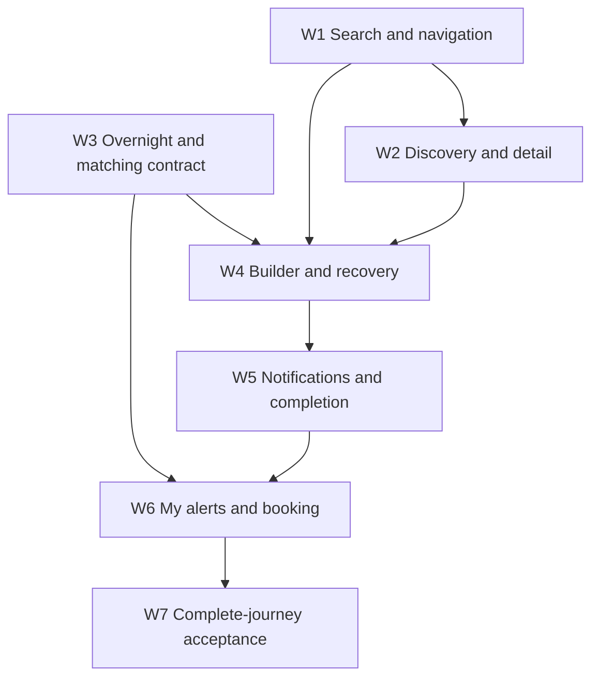

# First-release implementation brief

Status: proposed planning detail. Application code is unchanged. This document
turns the broader [experience plan](plan.md) into reviewable implementation slices.
The [clickable wireframe](wireframes.html) illustrates the core flow with fictional
places and sample dates; it makes no network requests and creates no real alerts.

## Recommended first release

A camper can find a supported campground, choose a specific stay or flexible window,
configure supported preferences, preserve their choices through sign-in, deliberately
choose notification setup or monitoring-only, and manage a saved alert. Matching
observations lead directly to the official booking system.

The first release includes the existing name-search/park-list discovery model.
Geographic exploration, new notification channels, favorites, trip groups, advanced
metadata, and a custom range calendar can follow independently. Neither a broad
map inventory nor external notification infrastructure should hold up accessible
search, good campground pages, and clear alert management.

## Working product decisions

These are recommendations to prototype and review, not recorded user approvals.

| Topic                | Recommended first-release behavior                                                | Reason                                                                                        |
| -------------------- | --------------------------------------------------------------------------------- | --------------------------------------------------------------------------------------------- |
| First action         | Search a park or campground without signing in.                                   | Lets campers establish a destination before committing.                                       |
| Builder entry        | Dedicated page; selected campground shown immediately.                            | More space for explanation and reliable mobile navigation.                                    |
| Progress             | Stay → Preferences → Review; notification readiness is part of review.            | Three comprehensible stages; returning users can skip optional refinement.                    |
| Specific stay        | Arrival/departure, with required nights derived from the dates.                   | Prevents a multi-night vacation from becoming a partial-stay alert.                           |
| Flexible window      | Earliest arrival/latest departure plus minimum consecutive nights.                | Expresses flexibility without implying all nights must be open.                               |
| Campground changes   | Preserve date/preferences; revalidate support and clear stale eligibility.        | Avoids needless re-entry without carrying unsupported requirements silently.                  |
| Authentication       | Configure first, sign in immediately before save, then resume review.             | Maintains intent; returning signed-in users bypass the detour.                                |
| No notifications     | Explicit “Monitor without notifications,” with explanation and persistent status. | Makes in-app monitoring possible while acknowledging messages will not arrive.                |
| Missing host channel | Describe host configuration issue separately from missing user setup.             | A user cannot repair an absent application token by re-entering their own key.                |
| Test message         | Provider-accepted test status; optional user acknowledgement of receipt.          | API acceptance cannot prove that a phone displayed the notification.                          |
| Repeated save        | Existing-alert link; preserve current draft for comparison.                       | A 409 conflict should be a useful destination, not a dead end.                                |
| Pause/delete         | Actions separate from title link; confirmed delete remains explicit.              | Stops accidental navigation and destructive ambiguity.                                        |
| Opening action       | “View reservation site,” with campsite/dates visible nearby.                      | The reviewed provider URL identifies a campground rather than guaranteed exact-site checkout. |

Prototype limitation: wireframe navigation, date intent, preferences, sign-in detour,
monitoring-only selection, and pause/resume are interactive. Search, provider support,
sign-in, monitoring, and observations are fictional demonstrations. Notification
setup/test and official booking are explanatory placeholders.

## Work packages and order

Packages may be separate PRs. Each has a user-visible outcome and a verification
gate. There is no requirement to finish every backend prerequisite before starting
independent frontend work. Do not release a UI claim ahead of its underlying behavior.

### W1 — Search and basic navigation (UX-04/05/07)

**Outcome:** campers can find and open the correct destination with keyboard,
touch, or assistive technology; ordinary card controls do not navigate unexpectedly.

**Touch points:** `SearchBar.tsx`, `SearchDropdown.tsx`, `useSearch.ts`, `Header.tsx`,
`ScanCard.tsx`, `RecreationArea.tsx`, and their behavioral tests.

- Share search behavior for public navigation and campground selection, with explicit
  selection callbacks. Keep API/query logic in existing client/hooks.
- Use manual-selection autocomplete consistently. Enter accepts the highlighted
  option; with no highlight, open the first current match while autocomplete is the
  only result surface. Do not change Enter behavior silently within the release.
- Disable selection during query mismatch; reset active selection after data changes;
  Escape closes loading/error/no-match states without blurring the field.
- Search failures preserve query and support retry. Prefer complete eligible results
  over post-filtering an arbitrary capped mixed response.
- Replace clickable containers with links and keep action controls outside links.
  Add accessible labels, explicit pending state, and visible mutation failures.

**Gate:** rapidly changing search never opens an old destination; pause/delete never
opens details; keyboard-only discovery and reset/retry work. This package can ship
without the new builder or date-contract changes.

### W2 — Truthful discovery and campground decisions (UX-01/06/08/09)

**Outcome:** the home page invites a search; park pages help choose; details offer
one clear alert action and a real reservation-site link.

**Touch points:** Home/Header/Providers/RecreationArea/Campground pages, shared
visual tokens, existing provider/campground metadata client calls.

- Adopt measured forest/neutral tokens, sensible page widths, and mobile search
  above decorative imagery. Destination suggestions trigger supported name searches.
- Replace static integration/channel claims with supported capabilities. Until a
  safe capabilities API exists, restrict public claims to verified integration support.
- Name-filter the complete park list; distinguish reservable metadata from availability.
- Resolve unreservable-list/detail mismatch before enabling alert actions for those
  entries. Either show browse-only details or explain ineligible choices consistently.
- Provide real provider URLs, sanitized short descriptions, metadata fallbacks, and
  usable lists when maps are absent. Correct zero-coordinate handling.

**Gate:** no card implies live availability or unsupported monitoring. Both mobile
and desktop users can reach an eligible campground without a map.

### W3 — Overnight and matching contract (UX-02/03)

**Outcome:** the app's date language and displayed openings mean what campers expect.

**Touch points:** backend request/response schemas, provider availability extraction,
worker matching/snapshot storage, scan list/detail serialization, relevant tests,
OpenAPI-generated frontend types.

- Standardize `start_date` as earliest camping night and `end_date` as exclusive
  departure. Specific stay sets minimum nights to the window length; flexible mode
  allows a shorter minimum. Store explicit date intent only if future display/edit
  behavior cannot be derived reliably from the existing window/minimum rule.
- Decide compatibility before changing extraction: existing stored end dates may
  have been entered as departure while executed inclusively. Enumerate which records
  can be interpreted safely; unknown intent cannot be reconstructed automatically.
- Enforce valid dates/minimum length on the server as well as the form. Use calendar
  arithmetic for nights; campground-local dates require reliable timezone metadata
  before features such as “past tonight” or next-weekend shortcuts.
- Preserve enough site metadata to evaluate saved type/electric preferences when
  serializing shared results. Reuse the same matching rule for notifications and UI.
- Return maximal consecutive matching date blocks with unambiguous arrival/departure
  boundaries. Minimum-N matching does not mean a reserved N-night booking exists.

**Gate:** exact and flexible examples below pass in provider/worker/API tests;
shared-target scans with different requirements receive appropriately different
results. Do not release exact-stay wording before this gate.

### W4 — Guided builder and recovery (UX-10/11)

**Outcome:** one reusable journey works from campground details or My alerts and
survives sign-in, back navigation, and errors.

**Touch points:** App routes, ScanForm extraction/replacement, Auth return handling,
existing scan mutation hook/client, safe draft storage, shared search selection.

- Implement one page-based builder and one validation/mapping path. Keep existing
  scan endpoints/internal names while using friendlier display wording.
- Scope draft to place/date intent/preferences/current stage, with a schema version,
  short expiration, and explicit start-over. Use session storage for initial draft
  continuity; store no passwords, tokens, or notification credentials there.
- A recommended draft lifetime is 24 hours, validated on restore; closing a session
  may discard it. Longer persistence across device/browser needs separate user-owned
  storage. Clear draft after confirmed successful creation or explicit discard.
- Preserve input on errors and cancelled auth. Auth0 redirects return to a safe
  local route; Basic login respects the same intent. Reject arbitrary external return
  destinations. Re-fetch eligibility/profile after returning.
- Keep campground selection when reopening the builder from the same detail page;
  reset deliberately when starting an unrelated alert. Track navigation changes.
- Field errors are connected to inputs; submit focuses the first invalid field.
  Optional preferences remain skippable and keyboard operable.

**Gate:** enter dates/preferences, sign in, return, and save without re-entry;
changing campground or going back never silently erases valid choices. Test cancelled
login, expired draft, removed campground, unsupported preference, and failed save.

### W5 — Notification readiness and save completion (UX-12/13)

**Outcome:** campers understand whether messages will be delivered and receive an
accurate completion screen.

**Touch points:** shared onboarding/profile UI, safe channel capability endpoint,
notification-test job/status endpoint if included, notification provider/task,
create-scan conflict response, builder completion.

- Minimal initial readiness: no destination configured, destination configured, or
  host channel unavailable. A configured key is not labeled verified.
- Add test-message requests with authenticated ownership, rate limiting, no credentials
  in payloads/URLs, and honest pending/provider-accepted/failed states. Pushover's
  [message API](https://pushover.net/api) does not make ordinary delivery acceptance
  equivalent to proof that a camper read the message.
- Validate the destination through Pushover's user-validation API when setup changes;
  it can identify a valid account with an active device, but does not confirm actual
  receipt. Use normal-priority tests rather than emergency acknowledgement loops.
  Invalid-input/quota failures require corrective action; transient provider failures
  use bounded retry. Do not let a Try again button repeat an unchanged invalid request.
- Setup links return to the current draft. Explain third-party requirements before
  asking for keys. User acknowledgement can say “I received the test,” distinct from
  server evidence; do not block saving forever because acknowledgement is missing.
- Monitoring-only choice stays visible on completion and My alerts. If the user removes
  their destination later, all affected alerts reflect missing notification readiness.
- Duplicate responses should identify the authorized existing alert or enable an exact
  lookup. The default paginated scan list is insufficient to guarantee discovery of it.
- Once the POST succeeds, route to the created alert using its response ID. Clear draft
  once success is known; do not infer failure solely from a delayed navigation.

**Gate:** no key/test/message failure creates a false readiness checkmark; double submit
creates at most one target subscription for the user; 409 yields a useful existing
alert action. Recovery from an uncertain network response rechecks existing state
before another create attempt, using the server's duplicate constraint.

### W6 — Alert status and opening-to-booking (UX-14/15)

**Outcome:** returning campers can tell what is being watched, control it, and act
on observations that meet their requirements.

**Touch points:** Dashboard/ScanCard/ScanDetail/Profile, pagination and scan client,
matching result contract from W3, metadata URL client, optional monitoring-state fields.

- Use title links, separate pause/resume, and explicit delete confirmation. Prefer
  pessimistic updates first for simplicity; feedback keeps the current item stable.
- My alerts uses returned total/pagination rather than counting the first page as all
  alerts. State tabs must apply to the whole dataset; backend filtered totals currently
  need alignment. Cross-page sorting/search need a complete query contract.
- Derive Waiting/Watching/Paused/Ended only from authoritative inputs. For legacy
  records without reliable campground timezone, show date-ended policy conservatively;
  do not display fabricated provider errors/next-check countdowns.
- Display matching observations from W3 with checked time and maximal night blocks.
  Empty matching observations are distinct from the first scan not running yet.
- Official link uses the campground metadata URL. Showing newly observed openings
  is not a promise that the provider still has inventory at click time.
- Preserve list filters/page/scroll when returning from detail. External booking opens
  with context available; choosing to open a new tab is explicit, accessible behavior.

**Gate:** counts/tabs remain correct across pages; failed updates stay actionable;
matching dates and booking URL agree with the selected alert. No link click is
counted as confirmed booking success.

### W7 — Complete-journey acceptance (UX-16)

Validate the integrated journey, rather than only individual components. Include
320px/390px phones, software keyboard, large text, light/dark/reduced-motion, keyboard
and screen reader, signed-out/signed-in, metadata gaps, map disabled, and network
failures. Use the existing task workflows and regenerate API types after contracts.
Run each focused test suite while implementing, then full quality gates before PR.

## Dependency graph

W3 can proceed alongside W1/W2. Notification endpoints can be designed alongside
builder work. This graph is dependency planning, not a request to delegate agents.

## Date examples that define the contract

All places/sites below are fictional; dates are synthetic test examples. Departure
is exclusive. A matching stay must be in one campsite; merging across sites is invalid.

| Intent                         | Inputs                      | Observed open nights             | Expected result                                            |
| ------------------------------ | --------------------------- | -------------------------------- | ---------------------------------------------------------- |
| Exact two-night stay           | June 18–20, 2027; minimum 2 | Site A: June 18, 19              | Match: arrival June 18, departure June 20.                 |
| Exact stay, first night absent | Same inputs                 | Site A: June 19, 20              | No match; checkout night cannot replace arrival night.     |
| Flexible minimum two           | June 18–23, 2027; minimum 2 | Site A: June 20, 21              | Match: arrival June 20, departure June 22.                 |
| Nonconsecutive nights          | Same flexible inputs        | Site A: June 18, 20              | No match; two separate nights do not form a stay.          |
| Different campsites            | Same flexible inputs        | Site A: June 20; Site B: June 21 | No match; changing sites is outside this release.          |
| Longer open block              | Same flexible inputs        | Site A: June 19, 20, 21          | Show one maximal block: June 19–22; at least 2 nights fit. |
| Type mismatch                  | Tent required; same dates   | RV-only site open all nights     | No user match even if shared target contains the site.     |
| Invalid minimum                | June 18–20; minimum 3       | Any data                         | Reject configuration; window has only 2 camping nights.    |

Exact and flexible modes can express the same rule if minimum equals window length.
If the UI must retain which mode the camper chose despite equivalence, persist intent
explicitly; otherwise do not invent a reliable historical mode from insufficient data.

## Errors as planned product behavior

| Trigger                                        | User message / action                                           | Draft/state handling                                         |
| ---------------------------------------------- | --------------------------------------------------------------- | ------------------------------------------------------------ |
| Search timeout                                 | “We couldn't load places. Try again.”                           | Preserve query; old results are not selectable.              |
| Required fields invalid                        | Specific date/selection instruction beside field.               | Focus first invalid field; preserve other values.            |
| Auth cancelled/expired                         | “Your choices are saved for this session. Sign in to continue.” | Resume review; revalidate profile and campground.            |
| Access policy denies save                      | Explain actual access requirement and request path.             | Preserve draft; return to public exploration if desired.     |
| Preference unsupported after campground change | Explain which requirement needs attention.                      | Require deliberate revision; never silently relax it.        |
| Channel unavailable on host                    | “Notifications aren't available on this installation.”          | Offer agreed monitor-only choice; no pointless key re-entry. |
| Test message failed                            | Show safe actionable reason and retry.                          | Keep configuration; don't imply working delivery.            |
| Duplicate alert                                | “You're already watching these dates.” / View existing alert.   | Keep draft if review/change is useful.                       |
| Create response uncertain                      | “We couldn't confirm the save. Checking your alerts…”           | Reconcile exact identity before reattempting.                |
| Pause/delete fails                             | “Couldn't pause/delete this alert. Try again.”                  | Keep existing card/status; don't navigate away.              |
| Metadata removed                               | “This campground is no longer available here.”                  | Offer park alternatives and official site when valid.        |

## Questions for prototype review

1. Can a first-time camper explain the difference between an exact stay and a
   flexible window from the labels and summary alone?
2. Does Preferences deserve its own stage, or should it collapse into Stay for
   campers without site requirements? Start with a skippable stage and compare.
3. Can a camper tell that monitoring-only will not send a message without being
   forced through external setup? Should this choice be uncommon but available?
4. Is a specific alert's last check and notification readiness more helpful than
   aggregate dashboard statistics? Prioritize those on the cards in the prototype.
5. Does having both Set an alert and View reservation site clarify the next action
   for someone who thinks camply books for them?

## Implementation readiness checklist

- Core layout/interaction proposal: documented and illustrated in the wireframe.
- Date semantics, migration approach, capability/access policy: require review and
  engineering validation before affected features ship.
- APIs: existing versus proposed contracts mapped; endpoint naming/data retention
  decisions are deliberately left to focused engineering designs.
- Tests: acceptance cases and recovery paths specified; not yet executed against
  a new application implementation.
- Assets: wireframe uses local vector shapes, system fonts, and fictional data;
  actual campground photography remains a licensed-content decision.
- Scope: W1/W2 can deliver independently; W3 gates exact-date/matching claims;
  W4–W7 produce the coherent first-release journey.
