# UI/UX plan: find a campground, start a useful alert

Status: proposed; planning/research session only. No application code changed.

The direction is **incremental improvements to the existing camply UI**. Preserve
the blue theme, centered home hero, navigation, card layouts, dashboard, and
single-dialog alert setup. Make finding a campground and setting up alerts easier
through better search, useful suggestions, clearer summaries, and reliable recovery.
Campflare and Campnab inform interaction details, while camply keeps its identity.

**First-release boundary:** no rebrand, replacement home composition, new primary
navigation, dedicated alert-builder route, or mandatory multistep wizard. Broader
ideas below are optional later candidates with separate validation gates.

This plan extends the existing frontend blueprint rather than replacing the
poller architecture. Read [the specification](spec.md) for acceptance criteria and
[the research](research.md) for source evidence and capability limitations.

The [first-release brief](implementation.md) defines concrete work packages;
[design review](design-review.md) records existing UI constraints and additional
feature opportunities. Use the [clickable wireframe](wireframes.html) to review
the proposed core journey before implementing it.

## 1. Design principles and tradeoffs

1. **One clear next action.** Search dominates the home page; setting an alert
   dominates campground details; booking dominates a matching-opening view.
2. **Let people explore first.** Ask for authentication when saving personal work,
   and preserve the work through sign-in. Keep external setup out of discovery.
3. **Start simple; reveal detail.** Dates and minimum nights are core. Specialized
   site/equipment requirements are optional and dependent on provider capabilities.
4. **Make state understandable.** Saved, monitoring, checked, notification-ready,
   and available mean different things. Show their differences in plain language.
5. **Make uncertainty visible.** Unknown metadata, a missing delivery test, and an
   old observation should be explicit; do not imply guarantees or success rates.
6. **Delight through ease.** Beautiful places, friendly wording, useful defaults,
   preserved context, and a small success moment matter more than animation volume.
7. **A list must stand on its own.** Maps enrich discovery, but the experience works
   on a phone, with low bandwidth, or without map configuration.

Enhance the existing `ScanForm` dialog for both campground and dashboard entry
points. Keep dates, minimum stay, type choices, and electric requirement together;
add concise help, validation, a stay summary, and delivery readiness. Preserve its
current visual treatment and actions. Improve height/overflow and focus handling
for small screens. A dedicated page or wizard is a later experiment only if observed
usability problems cannot be solved inside the existing dialog.

## 2. Information architecture

| Existing surface      | Incremental improvement                                                   | Route/container policy                                                  |
| --------------------- | ------------------------------------------------------------------------- | ----------------------------------------------------------------------- |
| Home                  | Suggestions and accurate introductory copy beside existing search.        | Keep `/` and current hero/sections.                                     |
| Park                  | Name filter, visible counts, semantic campground links.                   | Keep `/rec-area/:providerId/:recreationAreaId` and card/list layout.    |
| Campground            | Clear alert wording, eligibility help, official reservation link.         | Keep `/campground/:providerId/:campgroundId` and description/map cards. |
| Alert setup           | Human-readable selection, validation, stay summary, readiness.            | Keep `ScanForm` dialog opened from campground or dashboard.             |
| Dashboard             | Clear per-scan status, correct totals, separate controls, visible errors. | Keep `/dashboard`, heading, statistics, settings, and card grid.        |
| Alert detail          | Matching nights, observation time, booking link.                          | Keep current detail route and Overview/Availability cards.              |
| Notification settings | Reuse setup help and communicate configuration honestly.                  | Keep `/profile` and existing dashboard settings entry.                  |
| Help and coverage     | Accurate supported providers/channels.                                    | Keep `/providers`, `/how-it-works`, `/faq` and current navigation.      |

Retain Providers, How it works, Ethos, Contribute, account/theme controls, and the
existing mobile menu. Add a skip link, current-page semantics, route-change focus,
and auth-mode-aware actions in place. Keep critical controls reachable when the
header's scroll behavior changes. Do not introduce bottom navigation or relocate
community links in this first pass. `/explore` is an optional later route requiring
complete results infrastructure; no `/alerts/new` route or `/alerts` alias is needed.

## 3. Screen proposals

### 3.1 Existing home: make the first minute inviting

Keep the existing centered heading **“Find Campsites at Sold-Out Campgrounds”**,
blue primary color, search width, feature cards, How It Works, and closing CTA.

Small additions inside that structure:

- Add a visible search label and two or three supported destination suggestions
  directly beneath `SearchBar`. Suggestions populate/focus the actual search;
  verify metadata before choosing real destinations. No new scenic hero is required.
- Clarify the introduction: camply watches for openings; campers book directly
  through the official reservation provider. Correct unsupported channel/provider
  claims without rewriting the whole page's tone.
- Retain the signup CTA, adapting its wording/action to Basic versus Auth0 and
  signed-in state. Keep search as the direct path for people ready to choose a place.
- Preserve existing feature-card layout and artwork. Update only claims that exceed
  supported behavior. A compact draft-resume link can sit near search after recovery
  exists, without changing the hero composition.
- Keep the development notice and clear access information. Verify whether search
  is visible on a small phone; adjust hero padding only if measured viewport tests
  show it is pushed out of reach.

### 3.2 Search: predictable, useful, accessible

Autocomplete is for fast name lookup; a results page is for exploration. Start with
consistent autocomplete everywhere, then add complete browse/search infrastructure.

- Label the field “Park or campground”; keep placeholder as an example, not the label.
- Results show name, park/location when known, and “Park” versus “Campground.” Provider
  text is secondary. Parks lead to campground choices; campgrounds lead to details.
- Grouping by entity type can improve scanning; keyboard order must match visual order.
- Enter on a highlighted result opens it. In initial autocomplete-only mode, Enter
  without a selection opens the first current result. Once `/explore` exists, Enter
  without selection submits the query; document/test that intentional change.
- Arrow keys move the active option; Escape closes every state and keeps field focus;
  Tab continues normal focus; clear returns focus. Screen readers hear result counts.
- Suppress selectable old-query results while debouncing/loading. Cancel obsolete
  requests where supported. Keep input focus and avoid a moving dropdown height.
- Empty state: “No matches. Try a park name or a shorter search.” Network state:
  “We couldn't load places. Try again.” Preserve query on retry.
- Add session-only recent searches with clear-history control after the base flow.
  Persistent recent history requires a separate privacy decision.
- Search URLs should survive back/forward/share. Geographic/date/equipment refinements
  belong on complete server results, not a partial autocomplete list.
- Spelling suggestions, aliases, and name ranking are a backend search increment;
  use deterministic examples and avoid fuzzy matches presented as certainty.

### 3.3 Existing park pages: choose with confidence

First iteration uses the existing park campground list:

- Page heading, location, short overview, official source, and visible campground count.
- Name filter plus applicable Reservable/Monitoring-supported controls. Explain that
  reservable means provider metadata, not open inventory on the camper's dates.
- Stable alphabetical default; local filtering is valid on this complete park list.
- Each card has a semantic details link, optional supported status, short location,
  and an alert action only after eligibility is known. Avoid interactive controls
  nested inside a card-wide link.
- Distinguish no campgrounds from no filter matches; offer clear filters in the latter.
- Keep description short with expand/collapse. Raw provider HTML is sanitized.
- Use absent metadata placeholders sparingly: omit decorative gaps, explain unknown
  requirements where they affect suitability.

**Optional later experiment, outside the first release:** full Explore layout:

```text
[Destination / area] [Date intent, optional] [Filters]      List | Map

23 campgrounds · filters applied                  Sort: Name
[Campground card]                 [map with same result set]
[Campground card]                 [selected marker/card]
```

On mobile, show the list first; open map as an alternate view with a selected-card
tray. Provide an explicit “Search this area” action after map movement, avoiding
silent result churn. Location permission is requested only after “Near me.” Rejection
returns to manual search. Map and list share IDs/filters/selection and have equivalent
navigation; loading, configuration failure, and missing coordinates keep the list usable.
Map clusters, geographic queries, and total counts require backend work. Campflare's
public map/home suggest the direction; detailed map interactions remain our proposal.

### 3.4 Campground details: support the decision and next step

Keep the current name/provider/breadcrumb header, Monitor trigger, description/map
card, and alternatives card. Test clarifying the trigger to “Set an alert” in the
same position. Add “View reservation site” using the existing metadata URL without
recomposing the page.

- Show what is known about reservation/monitoring support, not an “Active” badge
  that could mean either metadata configuration or live monitoring.
- Keep the action in its current header position. First verify wrapping, touch targets,
  and zoom. A sticky action is an optional experiment only if discoverability suffers.
- Detail groups: overview/location, supported camping information, official rules
  link, and nearby alternatives within the same park. Amenities/equipment suitability
  appear only when reliable metadata exists.
- Match photos to the specific campground or explicitly identify them as regional
  imagery; retain licensing/attribution and a no-image fallback.
- Do not add ratings, prices, review counts, or “available now” badges from guesses.
- On an unsupported/unreservable location, explain the limitation and offer other
  campground choices or the official site instead of enabling a doomed save.
- Existing campground endpoint rejects unreservable metadata; resolve whether to
  expose browse-only details or exclude such entries consistently before the UI.

### 3.5 Existing alert dialog: make the matching rule easy to understand

Keep **one existing ScanForm dialog**, opened by the current campground Monitor
or dashboard New Scan action. Do not split its fields into mandatory stages.

```text
Create a New Scan                                      [Close]
Monitor a campground for cancellations.

Campground
[Pine Creek · Cedar Valley                         Change]

[Check-in]                           [Check-out]
[Minimum Stay (nights)]
Help: choose the full window length to require every night.
Summary: at least 2 consecutive nights, June 18–23.

Preferred Campsite Types   [Tent] [RV] [Cabin] [Other]
[Electric Hookup Required]

Notifications: not configured. [Set up]
[ ] Monitor without notifications (explicit choice if approved)

[Cancel]                                      [Create Scan]
```

Retain existing field order, dialog width, buttons, and badge appearance. Replace
nonsemantic clickable badges with keyboard-operable controls styled the same way.
Human place names replace internal IDs. A short inline summary explains the match
rule; help/setup can expand in place rather than adding another navigation step.

**Date intent**

- The current window/minimum form can express both rules. Requiring every night
  means minimum nights equals the window length. A shorter minimum means any
  consecutive stay of at least N nights within that window. Show this plainly.
- Preserve Check-in/Check-out labels once departure semantics are corrected; helper
  text explains that they bound a search window. Do not label the default minimum-1
  configuration an exact stay. Test a compact “Require all nights” shortcut only if
  the inline summary/help proves insufficient; a mode selector is not required.
- Always show a sentence preview: “Watch for at least 2 consecutive nights in one
  campsite between June 12 and June 16.” Examples use synthetic future dates in tests.
- Optional quick choices: next weekend or ±2 arrival days. Compute in the chosen
  campground timezone, let users edit, and show actual dates before saving. Ship only
  after date semantics are fixed; fixed holiday lists need locale handling.
- Reject past/impossible windows, checkout-before-arrival, and minimum nights longer
  than the available window. Enforce the same rules on the server.
- Treat dates as campground-local calendar dates, not UTC instants. Daylight-saving
  changes must not change the number of camping nights.
- Start with well-labeled native date fields. Evaluate a shared range calendar with
  selected range, month navigation, keyboard support, and typed-date alternatives
  once usability testing demonstrates benefit.

**Preferences**

- Default to any supported campsite type. Use real toggle buttons/checkboxes with
  pressed/checked state for Tent, RV, Cabin, Other; allow multiple selections.
- Present electric hookup as a requirement, not an unexplained technical filter.
- Explain that requirements narrow matches; never invent a probability estimate.
  Suggested relaxations can widen dates or reduce minimum nights, but must not suggest
  relaxing safety/accessibility or mandatory RV requirements.
- Accessibility, vehicle length, hookups, pets, and individual site numbers require
  per-provider metadata/capability work. Unknown is not “allowed” or “not available.”
- A campground search inside the builder uses the same debounced accessible behavior
  as public search, with eligible campground results. Avoid filtering a capped mixed
  response until only park hits remain; add an entity filter to search if needed.

**Notifications and review**

- Show a plain-language summary of place, date rule, required preferences, and delivery.
  Use expandable details rather than internal campground/provider IDs.
- Signed-out campers can configure first, then sign in to save. Resume the draft on
  return; cancelled login preserves it. Basic auth has no implied signup path.
- Pushover setup explains install/account/key steps, external cost, and why required.
  A saved key means configured, not verified or guaranteed operational.
- Preferred behavior: allow a deliberate “Save without notifications” choice with a
  clear reminder; do not silently create a monitoring-only alert. Confirm with users
  whether this choice causes more confusion than requiring notification setup.
- Add “Send test notification” only with a real server endpoint and user acknowledgement.
  Distinguish sent-to-provider from confirmed received on-device; avoid a fake checkmark.
- Preserve Create Scan as the primary action initially; test “Start watching” as a
  focused copy change. During save, disable duplicate submission and
  preserve the draft on failure. A duplicate response offers “View existing alert.”
- Completion fits the existing toast/detail transition: watched place, date summary,
  actual notification readiness, and link to the scan. A short friendly confirmation
  is enough; no replacement success page or illustration is required.
- If beta access is required, show it before final save and preserve the draft through
  the access request. Verify actual policy enforcement/routes before designing around it.

### 3.6 Existing dashboard: reassure, organize, and act

Keep the Dashboard heading, New Scan action, statistic cards, settings panel, and
scan grid. Add clearer watched-stay/status/readiness information inside `ScanCard`,
with visual treatment matching current cards. Optional filters should earn their
space through usage evidence and apply accurately across pagination; no mandatory
rename to My alerts or replacement management page.

- Cards show campground/park, date rule, requirements, state, last check, and delivery
  readiness. One title link opens details; pause/delete are separate controls.
- Make states mutually understandable: Waiting for first check, Watching, Paused,
  Ended. Monitoring delayed/error is an operational overlay requiring server data.
  “No matches yet” describes results, not a failed monitoring state.
- Ended takes precedence over Active. Use campground-local departure boundary and
  reconcile actual worker lifecycle before presenting definitive ended behavior.
- Surface mutation errors near the card and allow retry. Preserve previous state until
  success or roll back an optimistic update; pending controls have accessible labels.
- Delete confirmation names the campground/dates; focus returns to a sensible item.
  Prefer pause for “I don't need messages right now.” Do not offer Undo for a hard-delete
  API unless a real restore strategy exists.
- First empty state explains how to get started; filtered empty state offers reset.
  Avoid sad/failure imagery for somebody who simply has not created an alert.
- Retain the statistic cards and correct their data/labels. A loaded subset is not
  the overall total, shared observations are not user-matching openings, and openings
  are not bookings. Do not demote or remove statistics solely for a new visual hierarchy.
- Future trip labels such as “Birthday weekend” help distinguish similar alerts.
  Trip groups, bulk pause, and archive require models/endpoints and warrant separate work.

### 3.7 Alert detail and reservation handoff

Keep ScanDetail's Overview and Availability cards. Add matching consecutive date
blocks, campsite identity, check time, and a provider booking action within those
cards. Preserve the current heading and page layout.

- Initial booking link can use the existing campground metadata URL. Specific
  campsite/date links need provider adapters; never fabricate URL parameters.
- Use “View reservation site” when the destination does not preselect the site.
  Show campsite/date context alongside it so campers can find the opening there.
- Explain briefly that availability may change before booking; do not repeatedly
  interrupt actions with warnings or discourage the camper.
- A stale snapshot shows “Last observed…” rather than implying live verification.
  Automatic refresh updates in place; no forced navigation or losing selected cards.
- Offer supported filter editing. Date editing is separate backend work: move the
  user's subscription to a correct de-duplicated target, not mutate a shared target.
- Distinguish latest results from notification history. A real history records which
  match was sent, when, through which channel, and delivery outcome.
- “I booked a campsite” is optional user feedback in a later increment, followed by
  a deliberate pause action. Never infer a reservation from a link click.

### 3.8 Notification settings: make readiness concrete

Consolidate setup in one reusable experience with links from the builder/dashboard.
Show configured channel, relevant external setup instructions, masked credentials,
edit/remove actions, and test status once implemented.

The backend should expose safe capability/readiness summaries, never application
secrets. Distinguish no user destination, application channel unavailable, test
requested/sent/failed, and user-confirmed receipt. Existing Pushover high-priority
messages can bypass quiet hours; later preferences should explain and control urgency
with provider-appropriate behavior. Changes need backend delivery/settings support.

Longer-term channel decision: email reduces installation friction; browser push
can be convenient but needs permission and service-worker lifecycle handling;
Pushover fits existing/self-hosted workflows. Research deliverability, operating costs,
security, and user preferences before selecting the next channel. Do not ship dead
Email/SMS toggles as a promise of forthcoming support.

## 4. Visual and interaction system

- **Palette:** retain the current blue primary, white/slate surfaces, existing
  light/dark tokens, and brand identity in `frontend/src/index.css`. Audit rendered
  contrast and repair specific defects; no palette replacement is part of this plan.
- **Typography:** keep a readable sans-serif (current system stack or existing font),
  16px form text, clear heading hierarchy, comfortable line height. Avoid all-caps
  provider names and tiny status badges as the only status presentation.
- **Layout:** preserve current page widths, gutters, rounded cards, and section order.
  Add help/counts/summary inside existing components. Adjust only spacing that fails
  small-screen, long-name, keyboard, or zoom checks.
- **Images:** responsive, compressed, licensed, sized to prevent shifts. Lazy-load
  below-the-fold images; fallback backgrounds preserve layout.
- **Icons:** existing Lucide set with text for important actions. Label every icon-only
  control and keep dark-theme/status colors coherent.
- **Motion:** short, purposeful transitions for opening filters and success feedback;
  respect reduced motion. Avoid animated scenery competing with search.
- **Feedback:** skeletons resemble final content; background refresh is subtle;
  errors preserve entered work; success is announced with next action.
- **Mobile:** full-width primary controls, 44px target goal, safe-area padding, a
  builder layout that remains useful when the keyboard opens, and no nested scrolling
  traps. Test long campground names and text zoom instead of hiding them by truncation.
- **Accessibility:** semantics before ARIA patches. Reference [W3C combobox](https://www.w3.org/WAI/ARIA/apg/patterns/combobox/)
  and [dialog](https://www.w3.org/WAI/ARIA/apg/patterns/dialog-modal/) patterns; map-only
  results and custom calendars require equivalent keyboard-accessible interactions.

## 5. Experience state matrix

| Surface       | Essential states                                                                                 | Recovery / next action                                                 |
| ------------- | ------------------------------------------------------------------------------------------------ | ---------------------------------------------------------------------- |
| Search        | Idle, short query, debouncing, loading, results, none, failure.                                  | Suggestions, type more, clear, retry; Escape always works.             |
| Park list     | Loading, populated, empty park, filtered empty, list error, map unavailable.                     | Clear filters, retry list, continue with list.                         |
| Campground    | Loading, details, unknown metadata, unsupported, removed, network error.                         | Official site, other campgrounds, retry, return to results.            |
| Builder       | Draft, valid/invalid fields, auth required, setup required, saving, duplicate, failure, success. | Retain values, resume after detour, existing-alert link, retry.        |
| Notifications | Unconfigured, configured, unavailable host channel, testing, failed, sent, receipt confirmed.    | Setup/help, retry test, explicit save without notifications if chosen. |
| Dashboard     | None, loading, populated, filtered empty, mutation pending/failed, paused/ended.                 | New alert, reset filters, retry, resume/edit/confirm delete.           |
| Results       | First check pending, no current matches, matches, stale observation, provider delay/error.       | Show honest status, supported edits, official booking link.            |
| Auth/access   | Basic login, Auth0 login/signup, cancelled/error, beta access pending.                           | Return to draft, retry, explore publicly; preserve intent.             |

## 6. Backend and data prerequisites

| Capability                     | Existing foundation                                          | Required before the corresponding UI                                                                                                            |
| ------------------------------ | ------------------------------------------------------------ | ----------------------------------------------------------------------------------------------------------------------------------------------- |
| Exact/flexible overnight rules | Date window + minimum consecutive nights.                    | Define exclusive departure semantics, fix inclusive extraction, validate both ends and stay length; address existing saved-alert compatibility. |
| Matching results/counts        | Shared target snapshots, filter-aware notification matching. | Apply user requirements to result API with sufficient metadata; return matching blocks/counts consistently.                                     |
| Operational state              | Last successful check timestamp.                             | Safe check state/error/next-check metadata and provider cadence; distinguish delayed/no-match.                                                  |
| Eligible search                | Mixed name hits, limit 20; park metadata list.               | Entity/capability filtering and valid detail behavior for unreservable entries; consistent provider support.                                    |
| Full Explore                   | Name search + individual campground coordinates.             | Paginated browse/geographic filters, total counts, stable sort, coordinate handling, capability/metadata freshness.                             |
| Delivery readiness             | User key save + Pushover task.                               | Host capability summary, test endpoint/status, observable failures; distinguish provider accepted from device received.                         |
| Editing dates                  | PATCH only updates filters/active flag.                      | Subscription retargeting with ownership/de-duplication/duplicate handling; preserve history attribution.                                        |
| Richer filters                 | Type and electric matching, accessibility in DTO.            | Persist/expose required metadata, provider-specific filter capabilities, equipment/site catalogs and matching tests.                            |
| Multiple campgrounds           | One target per scan.                                         | Decide separate alerts versus trip group; atomic/best-effort bulk behavior, duplicate/conflict handling and request limits.                     |
| Alert history                  | Replaced latest snapshots.                                   | Notification events with timestamps, matched blocks, channels/outcomes, ownership and retention policy.                                         |
| Favorites/trip labels          | No reviewed endpoints/models.                                | Persisted user models or explicitly local-only favorites; grouping contract before presenting trip-wide controls.                               |
| Photos/amenities               | Description, coordinates, source URL.                        | Data source, rights, normalization, unknown handling, refresh process.                                                                          |

Do not mutate shared target dates to edit one user's alert. Resolve checkout
compatibility deliberately: existing inclusive windows may change meaning. Before
release, decide whether stored end dates represent last camping night or departure,
and use a migration/version rule where necessary rather than silently reinterpret them.

## 7. Prioritized backlog

Priority definitions: P0 = trust/usability prerequisite, P1 = core launch experience,
P2 = valuable expansion after validation, P3 = deferred idea. Effort is relative
(S/M/L), not a schedule commitment. “Backend” indicates contract/model/worker work,
not merely a frontend call to an existing endpoint.

| ID    | Feature / improvement                                                          | Priority | Effort | Dependency                                                               |
| ----- | ------------------------------------------------------------------------------ | -------- | ------ | ------------------------------------------------------------------------ |
| UX-01 | Accurate coverage/channel/cadence wording and capability-driven entry actions. | P0       | S–M    | Provider/auth/channel capability review.                                 |
| UX-02 | Overnight boundaries, stay validation, exact/flexible matching examples.       | P0       | M      | Backend/provider + saved-date compatibility.                             |
| UX-03 | User-filtered result blocks and accurate counts.                               | P0       | M      | Backend snapshot metadata/filter contract.                               |
| UX-04 | Shared accessible search; stale-response prevention and clear recovery.        | P0       | M      | Existing API; eligible entity filter may extend it.                      |
| UX-05 | Semantic navigation/controls and visible mutation errors.                      | P0       | S–M    | Existing frontend components.                                            |
| UX-06 | Existing home: accurate copy and destination suggestions.                      | P1       | M      | Accurate support data; existing Home components.                         |
| UX-07 | Existing header: auth-aware actions, skip link/route focus.                    | P1       | S      | Auth/capability policy.                                                  |
| UX-08 | Park list filtering, counts, stable sorting and map fallback.                  | P1       | M      | Existing full park list; eligibility decision.                           |
| UX-09 | Existing campground page: clearer alert / reservation actions.                 | P1       | M      | UX-01; metadata fallback.                                                |
| UX-10 | Enhance existing ScanForm dialog with validation and summary.                  | P1       | L      | UX-02, UX-04, UX-09.                                                     |
| UX-11 | Safe draft preservation and auth/access return flow.                           | P1       | M      | Dialog restore + verified access policy.                                 |
| UX-12 | Notification onboarding/readiness and deliberate monitoring-only option.       | P1       | M      | Host capability + product decision.                                      |
| UX-13 | Real test-notification journey and duplicate-alert resolution.                 | P1       | M      | Backend test/delivery endpoint; duplicate lookup.                        |
| UX-14 | Existing dashboard: clear status, accurate totals, action feedback.            | P1       | M      | UX-03; operational state as available.                                   |
| UX-15 | Result cards with freshness, matching nights and booking handoff.              | P1       | M      | UX-02/03; existing metadata URL.                                         |
| UX-16 | Mobile, dark-theme, keyboard and low-bandwidth acceptance pass.                | P1       | M      | Every core screen.                                                       |
| UX-17 | Full Explore search with bookmarkable filters and complete result totals.      | P2       | L      | Backend browse/pagination/filter API.                                    |
| UX-18 | Synchronized map/list, Near me and Search this area.                           | P2       | L      | UX-17 + geospatial API/map delivery choice.                              |
| UX-19 | Flexible-date shortcuts and accessible range-calendar enhancement.             | P2       | M      | UX-02 + usability evidence.                                              |
| UX-20 | Additional notification channel (evaluate email/browser push).                 | P2       | L      | Delivery infrastructure/cost decision.                                   |
| UX-21 | Notification history and actionable monitoring diagnostics.                    | P2       | L      | Backend event/operational contracts.                                     |
| UX-22 | Edit dates and duplicate existing alert with prefilled draft.                  | P2       | M–L    | Retargeting and duplicate semantics.                                     |
| UX-23 | Favorites and session recents with privacy controls.                           | P2       | M      | Storage/ownership decision.                                              |
| UX-24 | Multiple campgrounds, trip names/groups and bulk pause.                        | P2       | L      | Group model and multi-target save semantics.                             |
| UX-25 | Provider-specific RV/accessibility/site-number filters.                        | P2       | L      | Metadata and matcher support.                                            |
| UX-26 | Rich campground imagery/amenities and nearby suggestions.                      | P2       | L      | Licensed data + geographic metadata.                                     |
| UX-27 | User-confirmed booking outcome and optional pause follow-up.                   | P3       | M      | Outcome model; no provider booking inference.                            |
| UX-28 | Search aliases/spelling relevance and unsupported-location request path.       | P2       | M–L    | Search/index changes + metadata workflow.                                |
| UX-29 | Campground date-availability preview before creating an alert.                 | P2       | L      | Bounded public API, provider budget, cache, matching/freshness contract. |
| UX-30 | Optional arrival-weekday preferences for flexible windows.                     | P2       | M–L    | Persisted weekday rule and admissible-start matching.                    |
| UX-31 | Small campground comparison shortlist.                                         | P3       | M      | Useful normalized metadata and shortlist storage decision.               |
| UX-32 | Group compatible openings into fewer, more useful notifications.               | P2       | L      | Per-user batching, event history, preferences, provider limits.          |

See [design review](design-review.md) for UX-29–32 behaviors, constraints, and
review questions. These additions do not expand the first-release scope.

Defer social feeds, badges/streaks, generalized AI trip planning, paid fast lanes,
and automatic reservation booking. They do not address the current core friction.

## 8. Delivery sequence and review gates

**Phase A — truth and interaction foundations.** UX-01–05. Align date semantics,
matching results, real coverage, and actionable state; repair shared search and
control/navigation issues. Verify with behavioral tests and concrete date fixtures.
Gate: no UI labels imply unsupported capabilities or mismatched openings.

**Phase B — improve the existing end-to-end journey.** UX-06–16. Add suggestions
and accurate copy to Home, filtering to park cards, clear actions to details, and
summary/recovery/readiness to ScanForm. Improve dashboard/results in their current
layouts. Ship small component-focused slices with before/after screenshots. Gate: public discovery → auth return → saved useful alert
→ booking handoff passes acceptance tasks on phone and desktop.

**Phase C — broad discovery and easier delivery.** UX-17–20, UX-28. Extend result
APIs before map/filter UI; research the next notification channel. Gate: complete
result sets, stable map/list/back navigation, clear operating cost and permissions.

**Phase D — advanced monitoring and organization.** UX-21–27. Add observability,
date edits, favorites/groups, richer suitability filters and feedback based on usage.
Gate: no invented delivery history/booking outcomes; advanced requirements remain
provider-aware and comprehensible.

Each phase updates the feature tasks/global checklist, relevant design docs, and
API codegen when contracts change. Plans remain proposed until reviewed; this session
does not schedule release dates, publish changes, or mark implementation complete.

## 9. Validation plan

Use synthetic data/recorded provider responses for engineering tests. Start with
scenarios that would fail in current behavior, including stale-query selection,
checkout-night inclusion, mismatched result counts, lost auth drafts, and controls
nested in navigation links.

- Component tests: keyboard search, every search state, clear/retry, campground
  filtering, accessible preference selection, dialog validation/focus/restore,
  duplicate handling, save errors, and pause/delete failure behavior.
- API/worker tests: overnight boundary/DST/leap-day/month/year transitions, matching
  counts vs shared snapshots, unsupported capabilities, auth ownership, retargeting,
  delivery failure/test state, and multi-target duplicates if that feature ships.
- End-to-end: signed-out discovery to resumed alert; existing-ready user quick save;
  expired/paused/no-results alert; missing notification channel; partial metadata;
  map absent; official-site handoff with accurate date/site context.
- Responsive: 320/390/768/1440px, long names, mobile keyboard/safe areas, 200% text
  scaling, high zoom, dark/light, reduced motion, touch and keyboard.
- Assistive technology: VoiceOver and another supported screen reader; manual focus
  audit. Automated accessibility scanning supplements manual tasks.
- Performance: compare input responsiveness/search request counts and page asset
  weight before/after; defer map and noncritical imagery. Set numeric budgets from
  real baseline/device/network measurements rather than fabricated timings.
- Quality workflows: `task fix`, `task lint`, `task check`, `task test`, applicable
  pre-commit hooks, and production frontend compilation. Run focused tests per slice;
  full checks before a PR. Planning artifacts receive the repository quality gates; application-feature
  acceptance remains pending because application code is unchanged.

Usability study: 5–8 campers perform park-to-alert, exact two-night stay, flexible
weekend, auth interruption, notification readiness, and booking handoff tasks. Record
completion/assistance, misunderstandings, time, and a brief confidence/ease rating.
Recruit separately rather than contacting people in this session. Include a camper
with mandatory equipment/access needs and keyboard/assistive-technology use.

Minimal optional funnel events: search initiated, destination selected, form
opened/completed/abandoned, auth return completed, alert saved/duplicate, notification
configured/test outcome, and reservation link opened. Avoid raw query/date/location
or personal/credential payloads. Study booking outcomes only via explicit feedback.

## 10. Decisions to settle before implementation

| Decision                  | Recommended starting point                                       | Alternative / remaining evidence                                                |
| ------------------------- | ---------------------------------------------------------------- | ------------------------------------------------------------------------------- |
| Primary experience        | Existing public discovery followed by improved ScanForm dialog.  | Existing users may need a shorter direct path; test both.                       |
| Builder container         | Current single dialog with shared validation and restored state. | Page/wizard only after evidence that targeted dialog fixes are insufficient.    |
| Date model                | Existing window/minimum fields; departure exclusive.             | Preserve inclusive existing records only with explicit compatibility plan.      |
| Notification requirement  | Encourage readiness, allow deliberate monitoring-only save.      | Require configuration if testing shows users consistently miss the distinction. |
| Next channel              | Research email and browser push; retain Pushover.                | Select based on audience/delivery/cost, not visual preference.                  |
| First map increment       | List-first park view/fallback; full map discovery later.         | Map-first is useful only with complete geographic result coverage.              |
| Multiple campground model | Separate alerts first; group later when needed.                  | Atomic trip builder introduces persistence and partial-save complexity.         |
| Favorites                 | Session recents first; optional persisted favorites later.       | Local-only saves are simpler but need clear device-specific wording.            |
| Visual identity           | Retain current blue theme, typography, components, and layouts.  | Only measured contrast/spacing defects justify targeted visual changes.         |
| Access/coverage           | UI follows verified runtime policy/capabilities.                 | Documentation currently differs from code; resolve before presenting promises.  |

## 11. Planned design deliverables

The [implementation brief](implementation.md) now breaks the first release into
seven work packages with dependency gates, precise date examples, draft recovery,
and error behavior. The [responsive clickable wireframe](wireframes.html) covers
the existing home structure with suggestions, sample name search, the park card
list with filtering, campground cards, one ScanForm-style dialog, Dashboard cards,
and an opening inside the existing Availability layout.
It uses fictional places and local-only state; it creates no real alerts.

Full visual browser review, actual notification onboarding/auth detours, complete empty/error/loading
state sheets, high-fidelity assets, and camper usability sessions remain future
work. DOM-level checks exercise prototype behavior but do not establish visual or
screen-reader quality. The wireframe is a design artifact, not application code.

PR preparation includes limited Chrome spot-checks at 1440px desktop and 390px
mobile widths, with no horizontal overflow at either capture size. See the
[desktop home screenshot](screenshots/home-desktop.png) and
[mobile alert-dialog screenshot](screenshots/stay-mobile.png). These captures validate
example layouts only; they do not complete the device/accessibility audit.

```mermaid
flowchart LR
    A[Explore a park or campground] --> B[Choose campground]
    B --> C[Choose exact stay or flexible window]
    C --> D[Optional supported preferences]
    D --> E{Signed in?}
    E -- No --> F[Sign in and restore draft]
    F --> G[Notifications and review]
    E -- Yes --> G
    G --> H[Start watching]
    H --> I[Dashboard and matching observations]
    I --> J[Open official reservation site]
    J --> K[Camper completes booking with provider]
```



## Constitution check

The plan preserves frontend/backend boundaries, shared-target de-duplication,
strict types, honest provider-backed availability, and task-based verification.
New data models/endpoints are proposed only for named user features. Each increment
needs tests and documentation; nothing in this research session changes the
application, secrets, external services, or production state.
